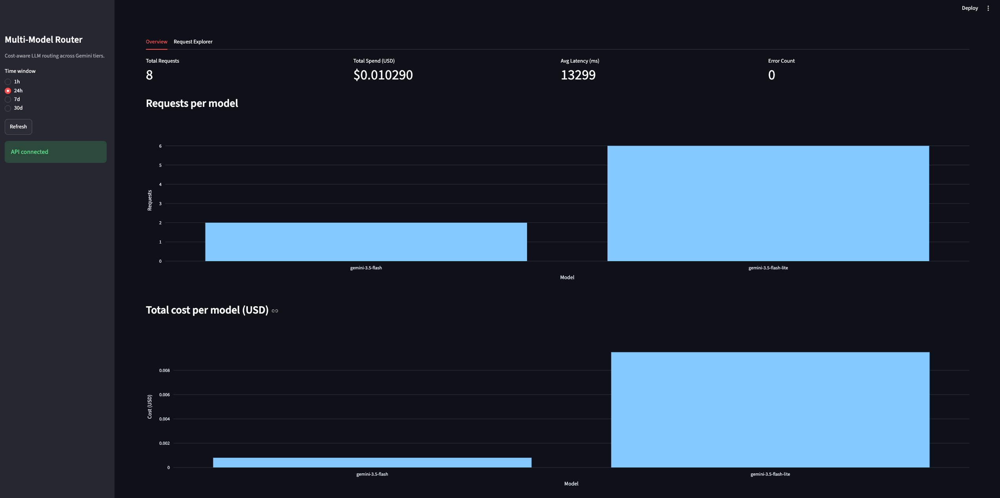

# Multi-Model Router

An AI gateway that classifies prompt complexity and routes each request to the cheapest capable Gemini model — maximising quality-per-dollar without manual model selection.


---

## Why this exists

LLM API costs vary enormously across model tiers. A simple "What is the capital of France?" costs 5× less on Gemini Flash Lite than on Gemini Flash — yet both give the same correct answer. This router inspects each prompt, assigns a complexity label (simple / medium / complex), and routes simple prompts to the cheapest tier while everything else goes to a capable mid-tier model. Every request is logged with token counts, latency, and cost so you can measure the tradeoff over time.

---

## Architecture

```
Client
  │
  ▼
FastAPI  ──────────────────────────────────────────────────
  │                                                        │
  ├─ POST /v1/route                                        │
  │      │                                                 │
  │      ▼                                                 │
  │   Classifier (rule-based)                              │
  │      │  label: simple / medium / complex               │
  │      ▼                                                 │
  │   Routing Service                                      │
  │      │  picks cheapest model                           │
  │      ▼                                                 │
  │   GeminiProvider (google-genai SDK)                    │
  │      │  calls Gemini API                               │
  │      ▼                                                 │
  │   DB Logger (SQLAlchemy async + Postgres)              │
  │      │  persists request + cost                        │
  │      ▼                                                 │
  │   Response  ◄──────────────────────────────────────────
  │
  ├─ GET  /v1/requests        (paginated history)
  ├─ GET  /v1/metrics/summary (spend / latency / quality aggregates)
  ├─ POST /v1/feedback        (human quality score)
  └─ GET  /health
```

---

## Quickstart

**Prerequisites:** Docker + Docker Compose.

```bash
cp .env.example .env
# Add your GEMINI_API_KEY to .env

docker compose up -d
```

The API will be available at `http://localhost:8000`.

```bash
# Route a prompt
curl -s -X POST http://localhost:8000/v1/route \
  -H "Content-Type: application/json" \
  -d '{"prompt": "What is 2 + 2?"}' | jq .

# Check health
curl http://localhost:8000/health

# View recent requests
curl "http://localhost:8000/v1/requests?limit=10" | jq .

# View metrics
curl "http://localhost:8000/v1/metrics/summary?window=24h" | jq .
```

---

## Environment Variables

| Variable | Required | Default | Description |
|---|---|---|---|
| `GEMINI_API_KEY` | Yes | — | Google AI Studio API key |
| `DATABASE_URL` | Yes | — | Async Postgres DSN (`postgresql+asyncpg://...`) |
| `REDIS_URL` | Yes | — | Redis DSN (`redis://localhost:6379/0`) |
| `APP_ENV` | No | `development` | `development` or `production` |
| `APP_NAME` | No | `Multi-Model Router` | Service name for logs |
| `LOG_LEVEL` | No | `INFO` | Logging level |
| `API_V1_PREFIX` | No | `/v1` | URL prefix for API routes |

See `.env.example` for a full template.

---

## API Endpoints

| Method | Path | Description |
|---|---|---|
| `POST` | `/v1/route` | Classify a prompt and route to cheapest capable model |
| `GET` | `/v1/requests` | Paginated list of logged requests (`limit`, `offset`, `model`) |
| `GET` | `/v1/metrics/summary` | Spend, latency p50/p95, quality by model (`window=1h\|24h\|7d\|30d`) |
| `POST` | `/v1/feedback` | Submit a human quality score for a past request |
| `GET` | `/health` | Service liveness check |

Interactive docs at `http://localhost:8000/docs`.

---

## Development

```bash
# Install dependencies
make install

# Start dev server (auto-reload)
make dev

# Run tests
make test

# Lint
make lint

# Type-check
make typecheck

# Format
make format

# Run full CI suite locally
make ci
```

### Database

```bash
# Start Postgres + Redis
make db-up

# Run migrations
make migrate

# Seed model pricing
make seed
```

---

## Project Structure

```
app/
├── api/
│   └── v1/
│       ├── feedback.py    # POST /v1/feedback
│       ├── metrics.py     # GET  /v1/requests, /v1/metrics/summary
│       ├── route.py       # POST /v1/route
│       └── router.py      # Aggregates v1 routes
├── core/
│   ├── classifier.py      # Rule-based prompt complexity classifier
│   ├── pricing.py         # Token-count → USD cost
│   └── quality.py         # Quality score helpers
├── db/
│   ├── base.py            # DeclarativeBase
│   └── session.py         # Async engine + session factory
├── models/                # SQLAlchemy ORM models
├── observability/
│   ├── logger.py          # Structured JSON logger
│   └── tracing.py         # Request-ID middleware
├── providers/
│   ├── base.py            # BaseProvider ABC
│   ├── factory.py         # Provider registry
│   └── gemini_provider.py # Google Gemini implementation
├── schemas/               # Pydantic request/response schemas
├── services/
│   ├── metrics_service.py # SQL aggregations
│   └── routing_service.py # Orchestration: classify → pick → call → log
├── config.py              # pydantic-settings config
├── dependencies.py        # FastAPI dependency helpers
└── main.py                # App entrypoint
```

---

## Dashboard

A Streamlit dashboard visualises spend-vs-quality across Gemini tiers in real time.

```bash
# Terminal 1 — start the API
make dev          # API on http://localhost:8000

# Terminal 2 — start the dashboard
make dashboard    # Dashboard on http://localhost:8501
```

Open **http://localhost:8501** in your browser.

**Overview tab** — KPI metrics, requests/cost bar charts, cost-vs-quality scatter, per-model table.
**Request Explorer tab** — filterable request log with CSV download.

---

## Screenshots



*Live dashboard showing the cost vs quality tradeoff across Gemini model tiers.*

## Roadmap

See [ROADMAP.md](ROADMAP.md).

---

## License

MIT — see [LICENSE](LICENSE) for details.
